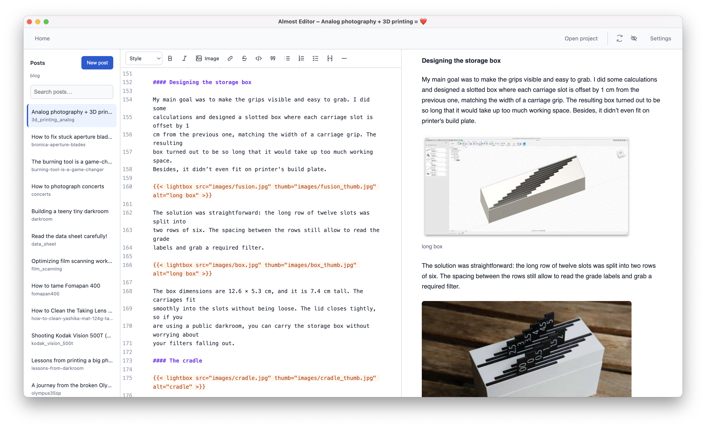

# Almost Editor

Almost Editor is a desktop Markdown editor tailored to [Hugo](https://gohugo.io) blogs that use page bundles and a Lightbox for rendering images.

This project is vibecoded. I built it to write posts for my blog, https://blog.almostinfocus.com.
While Markdown files can be edited anywhere, manually converting images and inserting shortcodes was always cumbersome.




## Requirements

- Node.js and npm
- [ImageMagick](https://imagemagick.org/) with the `magick` command available on your `PATH`

On macOS, install ImageMagick with:

```bash
brew install imagemagick
```

## Run the editor

```bash
npm install
npm start
```

`npm start` builds the bundled code editor before launching Electron.

## Tests

Run the focused unit/spec suite with:

```bash
npm test
```

The suite covers Hugo project discovery, generated post front matter, image-processing command construction, collision-safe image names, document insertion state, and Hugo Markdown preprocessing.

Run the Electron regression checks (requires ImageMagick) with `npm run build && node_modules/.bin/electron scripts/verify-electron.cjs`. They use temporary documents and isolated settings. Run `node_modules/.bin/electron scripts/verify-ui.cjs` for welcome, search, title-first creation, recent documents, keyboard resizing, and scroll-sync checks. Run `node_modules/.bin/electron scripts/verify-saving.cjs` for save-race, conflict, untitled-draft, recovery, and discard checks.

## Getting started

The welcome screen offers **Open project**, **Open file**, and **New draft**, plus the eight most recently opened or saved documents, with post titles above their paths. Use **Home** to return to it without closing your drafts, and **Back to editor** to resume writing. **Clear recent list** removes this history without deleting any files. Existing project and draft recovery still resume automatically at startup.

## Hugo project workflow

Open the root of a Hugo project with **Open project**. Almost Editor scans `content/posts` for directories containing `index.md` and shows those post bundles in the sidebar. Each entry shows its front-matter title above the directory name, with a **DRAFT** badge when its YAML or TOML front matter sets `draft` to `true`. Search matches either field, including unsaved title changes.

Select a post to open its `index.md`. The editor keeps unsaved buffers in memory while you move between posts, and marks changed posts with a yellow dot in both the sidebar and bottom status area. Save to write the changes to disk. Closing the window with unsaved buffers prompts you to save all changes, discard them, or cancel closing. When Almost Editor starts again, it restores the last Hugo project and reopens the post that was active when the app closed.

Use **File → New** to start an independent untitled draft. **File → Open Documents** switches between open files and untitled drafts without discarding changes.

Saves use a temporary file in the same directory and then replace the original, so a failed write does not truncate your Markdown file. If the file changed or was deleted outside Almost Editor, saving offers **Save a Copy…** or **Cancel**. Your draft stays in memory, and the external version is preserved. Save As also prevents overwriting another document already open in the editor. Edits made while a save is finishing remain marked unsaved.

Unsaved drafts are also stored separately in `draft-recovery.json` in the app's user-data folder. Recovery snapshots are written roughly every 300 ms during editing and before saves. After an unexpected exit, the app restores these drafts automatically; use **File → Open Documents** to access them. Recovery does not write to your Markdown files. The latest keystrokes can be lost if a crash happens before the next snapshot finishes. Choosing **Don’t Save** when closing explicitly discards the recovery drafts; cancelling close retains them.

Use the formatting toolbar above the editor for headings, bold, italic, strikethrough, inline and fenced code, block quotes, bulleted, numbered, and task lists, links, and horizontal rules. Bold, italic, and link insertion are also available with <kbd>Cmd/Ctrl+B</kbd>, <kbd>Cmd/Ctrl+I</kbd>, and <kbd>Cmd/Ctrl+K</kbd>.

To link text, select it and choose the link button. Enter a URL directly, or choose **Blog article** and select a page bundle from the current Hugo project. Article links are inserted with Hugo's `ref` convention, for example `[Film scanning]()`.

Use **New post** to create a new page bundle. Enter a post title; the editor suggests a directory name that you can change and shows the destination before creating the bundle:

```text
content/posts/<post-name>/
├── images/
└── index.md
```

Right-click a post in the project sidebar and choose **Delete Post…** to remove its entire page-bundle directory. Almost Editor shows a confirmation window before permanently deleting the Markdown file, images, and any other files in that directory.

The generated `index.md` uses Hugo TOML front matter:

```toml
+++
author = ""
title = "Post name"
date = "yyyy-mm-dd"
description = ""
tags = []
+++
```

## Custom lightbox shortcode

The preview recognizes this custom Hugo lightbox macro:

```go

```

It renders the thumbnail in the preview. Clicking it opens the full image in the editor's built-in lightbox overlay. Both paths are resolved relative to the current post bundle, so images in the adjacent `images/` directory work without extra configuration.

The preview also understands Hugo references in Markdown links, for example:

```md
[Film scanning]()
```

Clicking a previewed reference opens the target post in the project sidebar. Ordinary HTTP and HTTPS links open in your default browser. Preview HTML is sanitized; scripts, embedded frames, and event handlers are removed.

## Image workflow

Choose **Insert image** in the formatting toolbar, or drag an image into the editor. Enter optional alternative text describing the image, then confirm insertion. An unsaved draft must be saved first; the toolbar action opens the save dialog when needed. A drop highlight and persistent processing indicator show where the image will go and when conversion is underway. The editor creates two JPEG files in the current post's `images/` directory using `magick mogrify`:

| Output | Default resize | Default quality |
| --- | --- | --- |
| `images/image_name.jpg` | `1500x1500` | `70` |
| `images/image_name_thumb.jpg` | `500x500` | `60` |

Image imports choose an unused filename (for example, `image_name-1.jpg`) when a name is already taken. If you switch posts during conversion, the shortcode is added to the originating draft. If that draft changed during conversion, the shortcode is appended to avoid inserting at an outdated cursor position.

GIF files are copied into `images/` unchanged so animation is preserved. Their inserted shortcode uses the same GIF path for both `{src}` and `{thumb}`.

Almost Editor then inserts this default shortcode:

```go

```

Use **Settings → Image options** to change the full-size and thumbnail resize dimensions, JPEG quality, and the text inserted after processing an image. The shortcode template supports these placeholders:

- `{src}` — generated full-size image path
- `{thumb}` — generated thumbnail path
- `{alt}` — alternative text entered during insertion, empty by default

For example, the default template is:

```go
{{< lightbox src="{src}" thumb="{thumb}" alt="{alt}" >}}
```

The template must contain `{src}`; `{thumb}` and `{alt}` are optional, so standard Markdown such as `` also works. All image options are saved and restored when the app reopens. Resize/quality settings and the shortcode template each have their own reset-to-default button.

## View and keyboard controls

Click the synchronization icon beside the preview toggle to enable **Sync editor and preview** to link editor and preview scrolling in either direction. It is off by default and your choice is remembered. Scrolling follows relative position rather than matching individual paragraphs, so image-heavy posts can differ between panes. Turn it off to scroll independently.

The editor and preview keep their chosen width ratio when you resize the window or sidebar. Pane dividers support dragging or keyboard resizing: Tab to a divider and use Left/Right arrows, holding Shift for larger steps. Dialogs keep keyboard focus inside them and support Escape to close. The formatting toolbar displays its actions on one row and moves only the actions that do not fit into **More formatting (•••)**. Expanding the pane brings those actions back; the three-dot button disappears when everything fits. These popovers close with Escape or a click outside. Theme and text size are available under **Settings**. The window title follows the active document as **Almost Editor – Post title**, including unsaved title edits.

## Features

- Markdown syntax highlighting, Hugo shortcode highlighting, line numbers, and configurable editor text size (9–20px)
- Markdown formatting toolbar with standard text, list, code, quote, rule, and link controls
- Live Hugo-oriented Markdown preview with YAML and TOML front matter removed
- Lightbox and Hugo `ref` shortcode preview support
- Resizable project sidebar, editor, and preview panes
- Light and dark themes, plus a system-theme option
- Persistent theme, text size, image settings, window size, last file directory, last Hugo project, and active post
- Project sidebar for Hugo post bundles, in-app post creation, and confirmed directory deletion
- Unsaved-change indicators and in-memory drafts while switching posts
- Image conversion and configurable shortcode insertion powered by ImageMagick

## Notes

The editor preview is a focused local preview rather than a full Hugo site build. Hugo templates, layouts, and arbitrary shortcodes outside the supported lightbox and `ref` forms are rendered by Hugo itself when you build your site.
